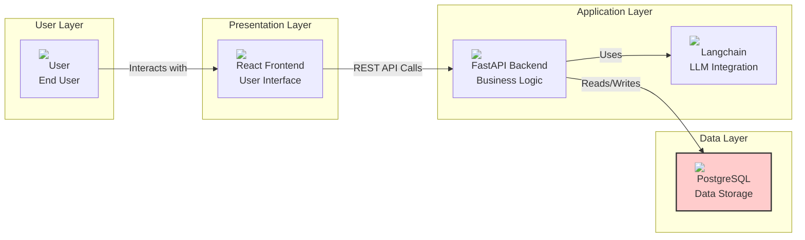
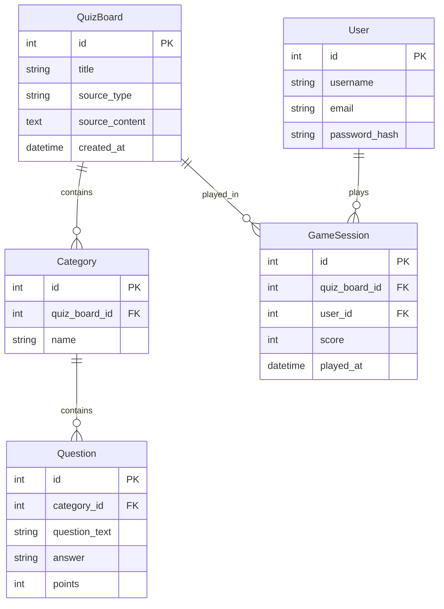
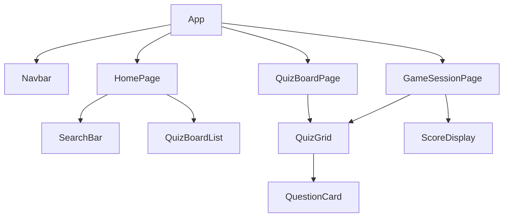

# Project Jeopardyze - Design Document

## 1. System Overview
### 1.1 Purpose
Jeopardyze is a web application that generates Jeopardy-style quizzes using LLMs. It can create quizzes from uploaded documents, user-provided topics, or daily trending news.

### 1.2 System Architecture


## 2. Data Model

### 2.1 Database Schema


## 3. API Design

### 3.1 Endpoints

#### Quiz Board Management
- `POST /api/quiz-boards/from-document`
  - Upload document or paste content
  - Returns generated quiz board

- `POST /api/quiz-boards/from-topic`
  - Accept topic/description
  - Returns generated quiz board

- `GET /api/quiz-boards`
  - List available quiz boards
  - Supports search and filtering

- `GET /api/quiz-boards/{id}`
  - Get specific quiz board details

#### Game Session
- `POST /api/game-sessions`
  - Start new game session
  - Returns session ID

- `PUT /api/game-sessions/{id}/score`
  - Update score for session

- `GET /api/game-sessions`
  - List user's game sessions

#### User Management
- `POST /api/users/register`
- `POST /api/users/login`
- `GET /api/users/profile`

## 4. Frontend Design

### 4.1 Component Structure


### 4.2 Key Components
1. QuizBoardList
   - Displays available quiz boards
   - Shows top scores
   - Search functionality

2. QuizGrid
   - N x M grid display
   - Category headers
   - Question cards with point values

3. QuestionCard
   - Question display
   - Answer input
   - Point value display

4. ScoreDisplay
   - Current score
   - Game progress

## 5. User Flows and URL Structure

### 5.1 URL Patterns
```
/                   # Home page - List of available quiz boards
/upload             # Document upload page
/create             # Topic-based quiz creation page
/quiz-board/:id     # View a specific quiz board
/play/:id          # Play a specific quiz board
/profile           # User profile and game history
/login             # User login
/register          # User registration
```

### 5.2 User Flows

#### Quiz Board Creation Flow
1. Document-based Creation:
   ```
   /upload
   ↓ (Upload document)
   POST /api/quiz-boards/from-document
   ↓ (Success)
   /quiz-board/:id
   ```

2. Topic-based Creation:
   ```
   /create
   ↓ (Enter topic)
   POST /api/quiz-boards/from-topic
   ↓ (Success)
   /quiz-board/:id
   ```

#### Game Play Flow
```
/quiz-board/:id
↓ (Start game)
POST /api/game-sessions
↓ (Success)
/play/:id
↓ (Answer questions)
PUT /api/game-sessions/:id/score
↓ (Game complete)
/profile
```

#### User Authentication Flow
```
/login or /register
↓ (Submit credentials)
POST /api/users/login or /api/users/register
↓ (Success)
/
```

### 5.3 Page Components and Features

#### Home Page (/)
- Search bar for quiz boards
- List of available quiz boards
- Top scores display
- Quick access to create/upload

#### Upload Page (/upload)
- Document upload interface
- Text input area for pasting content
- Progress indicator for generation
- Error handling for invalid inputs

#### Create Page (/create)
- Topic input field
- Description input (optional)
- Generation progress indicator
- Error handling for invalid inputs

#### Quiz Board Page (/quiz-board/:id)
- Quiz board grid display
- Category headers
- Question cards
- Start game button
- Share button
- View previous scores

#### Play Page (/play/:id)
- Quiz board grid
- Score display
- Question modal
- Answer input
- Timer (optional)
- Game progress indicator

#### Profile Page (/profile)
- User information
- Game history
- Statistics
- Achievements (future feature)

### 5.4 Navigation Structure
```mermaid
graph TD
    Home[/] --> Upload[/upload]
    Home --> Create[/create]
    Home --> Profile[/profile]
    Home --> QuizBoard[/quiz-board/:id]
    QuizBoard --> Play[/play/:id]
    Play --> Profile
    Upload --> QuizBoard
    Create --> QuizBoard
```

### 5.5 State Management
- Quiz board data
- Game session state
- User authentication state
- UI state (modals, loading states)

## 6. LLM Integration

### 6.1 Quiz Generation Process
1. Document Processing
   - Text extraction
   - Content analysis
   - Key topic identification

2. Category Generation
   - Topic clustering
   - Category naming
   - Difficulty distribution

3. Question Generation
   - Question-answer pair creation
   - Point value assignment
   - Answer validation

### 6.2 Prompt Engineering
- Document-based prompts
- Topic-based prompts
- News-based prompts

## 7. Security Considerations

### 7.1 Authentication
- JWT-based authentication
- Password hashing
- Session management

### 7.2 Data Protection
- Input validation
- SQL injection prevention
- XSS protection

## 8. Performance Considerations

### 8.1 Caching Strategy
- Quiz board caching
- User session caching
- API response caching

### 8.2 Database Optimization
- Indexing strategy
- Query optimization
- Connection pooling

## 9. Testing Strategy

### 9.1 Test Types
- Unit tests
- Integration tests
- End-to-end tests
- LLM response validation

### 9.2 Test Coverage
- API endpoints
- Database operations
- Frontend components
- LLM integration

## 10. Deployment Strategy

### 10.1 Infrastructure
- Containerization (Docker)
- CI/CD pipeline
- Monitoring and logging

### 10.2 Environment Setup
- Development
- Staging
- Production

## 11. Future Enhancements
1. Multiplayer support
2. Custom quiz board creation
3. Social features
4. Analytics dashboard
5. Mobile application

