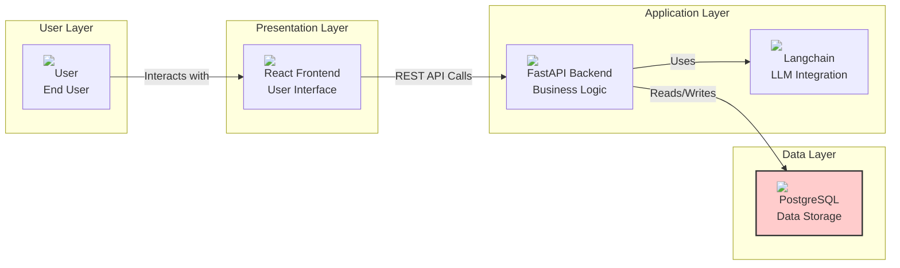
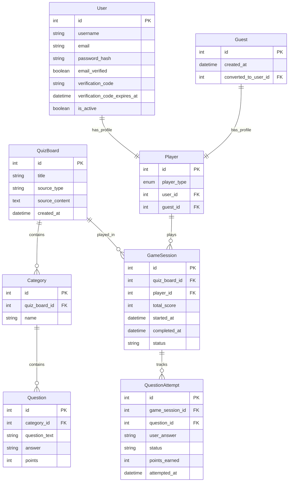
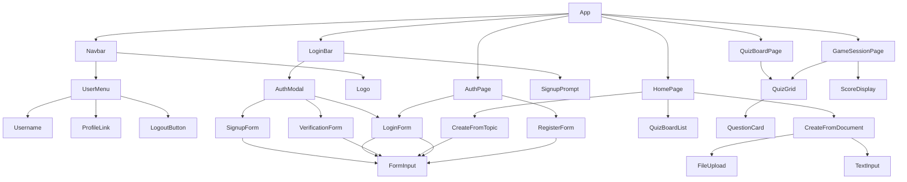
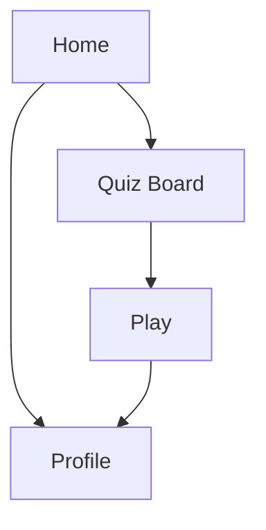

# Project Jeopardyze - Design Document

## 1. System Overview
### 1.1 Purpose
Jeopardyze is a web application that generates Jeopardy-style quizzes using LLMs. It can create quizzes from uploaded documents, user-provided topics, or daily trending news.

### 1.2 System Architecture


## 2. Data Model

### 2.1 Database Schema


## 3. API Design

### 3.1 Endpoints

#### Quiz Board Management
- `POST /api/quiz-boards/from-document`
  - Upload document or paste content
  - Returns generated quiz board

- `POST /api/quiz-boards/from-topic`
  - Accept topic/description
  - Returns generated quiz board

- `GET /api/quiz-boards/top`
  - Lists top quiz boards by number of game sessions
  - Query parameters:
    - `limit` (optional): Number of quiz boards to return (default: 10)
    - `offset` (optional): Pagination offset (default: 0)
  - Returns:
    ```json
    {
        "quiz_boards": [
            {
                "id": "string",
                "title": "string",
                "total_sessions": integer,
                "top_score": integer,
                "top_score_username": "string",              
                "created_at": "datetime"
            }
        ],
        "total": integer,
        "limit": integer,
        "offset": integer
    }
    ```

#### Game Session
- `POST /api/game-sessions/new-from-quiz-board/{quizBoardId}`
  - Creates a new game session for a quiz board
  - Returns:
    ```json
    {
        "game_session_id": "string",
        "session_quiz_board": "string",
        "status": "in_progress",
        "started_at": "datetime"
    }
    ```

- `GET /api/game-sessions/{id}`
  - Get game session details including:
    - Current score
    - Question states (unattempted/attempted/correct/wrong)
    - Attempted answers
    - Game status
    - Game progress
  - Response format:
    ```json
    {
        "gameSessionId": "string",
        "quizBoardId": "string",
        "totalScore": integer,
        "status": "in_progress",
        "questions": [
            {
                "questionId": "string",
                "category": "string",
                "points": integer,
                "status": "unattempted",
                "userAnswer": null,
                "isCorrect": null,
                "pointsEarned": 0
            }
        ],
        "progress": {
            "totalQuestions": integer,
            "attemptedQuestions": integer,
            "correctAnswers": integer,
            "wrongAnswers": integer
        }
    }
    ```

- `POST /api/game-sessions/{id}/answer-question/{questionId}`
  - Submit answer for a question
  - Request body:
    ```json
    {
        "answer": "string"
    }
    ```
  - Response:
    ```json
    {
        "is_correct": boolean,
        "points_earned": integer,
        "correct_answer": "string",
        "updated_score": integer,
        "game_status": "string"
    }
    ```

#### Authentication
- `POST /api/auth/guest`
  - Creates a new guest session and player profile
  - Returns:
    ```json
    {
        "access_token": "string",  # JWT token containing player_id, display_name, player_type
        "player_id": "string",
        "display_name": "string"
    }
    ```

- `POST /api/auth/register`
  - Register new user and create player profile
  - Request:
    ```json
    {
        "username": "string",
        "email": "string",
        "password": "string"
    }
    ```
  - Response:
    ```json
    {
        "message": "Verification code sent to email",
        "email": "string"
    }
    ```

- `POST /api/auth/verify-email`
  - Verify email with code
  - Request:
    ```json
    {
        "email": "string",
        "code": "string"
    }
    ```
  - Response:
    ```json
    {
        "access_token": "string",  # JWT token containing player_id, display_name, player_type
        "token_type": "bearer",
        "player_id": "string",
        "display_name": "string"
    }
    ```

- `POST /api/auth/login`
  - Login with credentials
  - Request:
    ```json
    {
        "username_or_email": "string",
        "password": "string"
    }
    ```
  - Response:
    ```json
    {
        "access_token": "string",  # JWT token containing player_id, display_name, player_type
        "token_type": "bearer",
        "player_id": "string",
        "display_name": "string"
    }
    ```

## 4. Frontend Design

### 4.1 Component Structure


### 4.2 Key Components
1. Navbar
   - Logo (links to home)
   - Authentication section:
     - Login/Register buttons (when not logged in)
     - Username display and dropdown menu (when logged in)
       - Profile link
       - Logout button
   - Responsive design for mobile

2. QuizBoardList
   - Displays available quiz boards
   - Shows top scores
   - Search functionality

3. QuizGrid
   - N x M grid display
   - Category headers
   - Question cards with point values

4. QuestionCard
   - Question display
   - Answer input
   - Point value display

5. ScoreDisplay
   - Current score
   - Game progress

6. LoginBar
   - Signup prompt for guest users
   - Auth modal trigger
   - Responsive design

7. AuthModal
   - Signup form (username + email + password)
   - Login form (username/email + password)
   - Verification form (code input)
   - Smooth transitions between forms
   - Error handling and validation

## 5. User Flows and URL Structure

### 5.1 URL Patterns
```
/                   # Home page - Create quiz boards and list existing ones
/quiz-board/:id     # View a specific quiz board
/play/:id          # Play a specific quiz board
/profile           # User profile and game history
/login             # User login
/register          # User registration
```

### 5.2 User Flows

#### Quiz Board Creation Flow
1. Document-based Creation:
   ```
   / (Home page)
   ↓ (Upload document or paste content)
   POST /api/quiz-boards/from-document
   ↓ (Success)
   /quiz-board/:id
   ```

2. Topic-based Creation:
   ```
   / (Home page)
   ↓ (Enter topic)
   POST /api/quiz-boards/from-topic
   ↓ (Success)
   /quiz-board/:id
   ```

#### Game Play Flow
```
/quiz-board/:quizBoardId
↓ (Start game)
POST /api/game-sessions
↓ (Success - returns gameSessionId)
/play/:gameSessionId
↓ (Fetch all questions for the quiz board)
GET /api/quiz-boards/:quizBoardId/questions
↓ (Display game board with hidden questions)
/play/:gameSessionId
↓ (Select question card)
↓ (Display question modal with answer input)
↓ (Submit answer)
POST /api/game-sessions/:gameSessionId/questions/:questionId/answer
↓ (Backend validates answer using LLM and updates score)
↓ (Return response with validation result and updated score)
↓ (Update UI with answer result and new score)
↓ (Return to game board)
↓ (Repeat for each question)
↓ (Game complete - show completion modal)
/play/:gameSessionId
```

#### Authentication Flow
1. Guest User Flow:
   ```
   / (Home page)
   ↓ (Start playing)
   POST /api/auth/guest
   ↓ (Success - returns player token with player_id, display_name, player_type)
   /play/:gameSessionId
   ↓ (During gameplay)
   LoginBar shows "Signup to save progress"
   ↓ (Click signup)
   AuthModal opens
   ↓ (Enter username, email & password)
   POST /api/auth/register
   ↓ (Enter verification code)
   POST /api/auth/verify-email
   ↓ (Success - returns player token with player_id, display_name, player_type)
   Guest session converted to user session
   ```

2. Returning User Flow:
   ```
   / (Home page)
   ↓ (Click login)
   AuthModal opens
   ↓ (Enter username/email & password)
   POST /api/auth/login
   ↓ (Success - returns player token with player_id, display_name, player_type)
   / (Home page, logged in)
   ```

#### User Authentication Flow
```
/login or /register
↓ (Submit credentials)
POST /api/auth/login or /api/auth/register
↓ (Success)
/
```

### 5.3 Page Components and Features

#### Home Page (/)
- Create Game section with:
  - Topic input form
  - Document upload interface
  - Text input area for pasting content
  - Progress indicators for generation
  - Error handling for invalid inputs
- Existing Games section with:
  - Search bar for quiz boards
  - List of available quiz boards
  - Top scores display
  - Quick access to play games

#### Quiz Board Page (/quiz-board/:id)
- Quiz board grid display
- Category headers
- Question cards
- Start game button
- Share button
- View previous scores

#### Play Page (/play/:gameSessionId)
- Quiz board grid with:
  - Category headers
  - Question cards (initially showing point values)
  - Click handlers for each card
- Score display (updated after each answer)
- Question modal with:
  - Question display
  - Answer input box
  - Submit button
  - Feedback on answer correctness
- Game progress indicator
- Game completion modal (shown when all questions are answered) with:
  - Final score display
  - Share results button
  - Play again button
  - Return to home button
- Return to board button

#### Profile Page (/profile)
- User information
- Game history
- Statistics
- Achievements (future feature)

### 5.4 Navigation Structure


### 5.5 State Management
- Quiz board data
- Game session state:
  - Question states (unattempted/attempted/correct/wrong)
  - Attempted answers
  - Current score
  - Game progress
  - Game status (in_progress/completed)
- Player authentication state:
  - player_id
  - player_type (user|guest)
  - display_name
  - access_token
- UI state (modals, loading states)

#### Game Session State Example
```json
{
    "gameSessionId": "string",
    "quizBoardId": "string",
    "totalScore": integer,
    "status": "in_progress",
    "questions": [
        {
            "questionId": "string",
            "category": "string",
            "points": integer,
            "status": "unattempted",
            "userAnswer": null,
            "isCorrect": null,
            "pointsEarned": 0
        },
        {
            "questionId": "string",
            "category": "string",
            "points": integer,
            "status": "correct",
            "userAnswer": "string",
            "isCorrect": true,
            "pointsEarned": integer
        }
    ],
    "progress": {
        "totalQuestions": integer,
        "attemptedQuestions": integer,
        "correctAnswers": integer,
        "wrongAnswers": integer
    }
}
```

## 6. LLM Integration

### 6.1 Quiz Generation Process
1. Document Processing
   - Text extraction
   - Content analysis
   - Key topic identification

2. Category Generation
   - Topic clustering
   - Category naming
   - Difficulty distribution

3. Question Generation
   - Question-answer pair creation
   - Point value assignment
   - Answer validation

### 6.2 Prompt Engineering
- Document-based prompts
- Topic-based prompts
- News-based prompts

## 7. Security Considerations

### 7.1 Authentication
- JWT-based authentication
- Password-based authentication
- Email verification for signup
- Guest session support
- Token refresh mechanism
- Session management

#### JWT Token Structure
1. Unified Player Token (for both guests and users):
   ```json
   {
       "player_id": "string",
       "player_type": "user|guest",
       "display_name": "string",
       "exp": "number"
   }
   ```

#### Token Management
- Player tokens expire after 30 days
- Email verification codes expire after 15 minutes
- Tokens stored in localStorage
- Automatic token refresh mechanism
- Secure token transmission using HTTPS

#### Password Security
- Passwords are hashed using bcrypt
- Minimum password requirements:
  - At least 8 characters
  - At least one uppercase letter
  - At least one lowercase letter
  - At least one number
  - At least one special character
- Password reset functionality (future enhancement)

### 7.2 Data Protection
- Input validation
- SQL injection prevention
- XSS protection

## 8. Performance Considerations

### 8.1 Caching Strategy
- Quiz board caching
- User session caching
- API response caching

### 8.2 Database Optimization
- Indexing strategy
- Query optimization
- Connection pooling

## 9. Testing Strategy

### 9.1 Test Types
- Unit tests
- Integration tests
- End-to-end tests
- LLM response validation

### 9.2 Test Coverage
- API endpoints
- Database operations
- Frontend components
- LLM integration

## 10. Deployment Strategy

### 10.1 Infrastructure
- Containerization (Docker)
- CI/CD pipeline
- Monitoring and logging

### 10.2 Environment Setup
- Development
- Staging
- Production

## 11. Future Enhancements
1. Multiplayer support
2. Custom quiz board creation
3. Social features
4. Analytics dashboard
5. Mobile application

